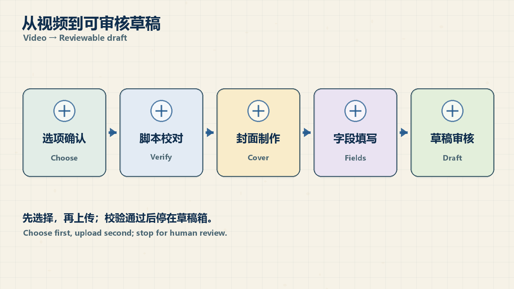
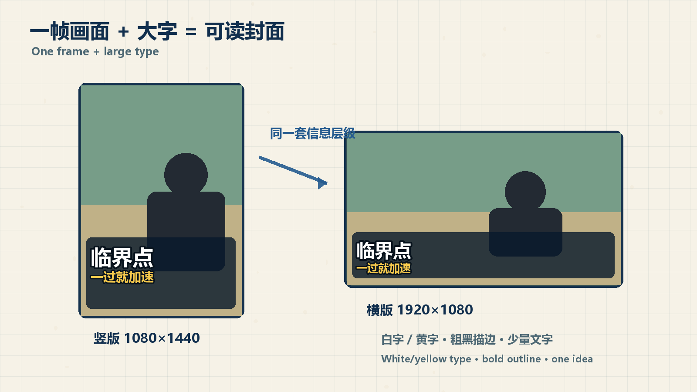

# 蚁小二媒体草稿 Skill

把本地视频和 Obsidian 脚本整理成可审核的多平台草稿：定位素材、制作横竖封面、补齐发布字段，再通过 yxer 保存到**蚁小二内部草稿箱**，由用户审核后手动发布。

## v0.2.0：WorkBuddy 可用

支持 **WorkBuddy、Codex，以及具备本地文件和终端能力的其他 Agent**。使用普通 SKILL.md、Python 和 yxer CLI，不依赖 Codex 专用工具。

Windows WorkBuddy 自带 Python 环境已验证：依赖检查、真实 final.mp4 定位、中文横竖封面生成、五平台现有 payload 的校验与内部草稿 dry-run。兼容性测试不新增草稿、不公开发布。WorkBuddy UI 的模型自动发现及所有第三方模型的端到端行为不在本次验证范围；首次接入后新建会话，必要时显式给出 SKILL.md 路径。

本版修复：final 文件漏检、封面固定主题文字、字幕透底、Windows 中文输出编码，以及 B站分类数组的来源记录冲突。



## 快速开始

在 WorkBuddy 或其他本地 Agent 中输入：

```text
使用 yixiaoer-media-draft 处理这篇文章：
封面从视频截图加字；脚本用现有文章；
视频号、小红书、抖音、快手、B站各做一份草稿；
自动生成标题、短标题、简介和标签；原创，公开可见；
只保存蚁小二内部草稿，更新文章为“已存草稿”，由我审核后发布。
```

Codex 也可使用 `$yixiaoer-media-draft`。已确认的选项和可查到的历史约定直接沿用，只补问影响结果的缺失信息。用户本次说明优先于文章的旧状态。

## 安装

需要 **yxer CLI 及其官方技能、Python 3.10+、Pillow、ffprobe**。配置好本机 yxer 后，在目标 Agent 的 Python 环境运行 `scripts/preflight.py`。

| 宿主 | 技能目录 |
| --- | --- |
| WorkBuddy | `~/.workbuddy/skills/yixiaoer-media-draft/` |
| Codex | `~/.codex/skills/yixiaoer-media-draft/` |
| 支持通用技能目录的 Agent | `~/.agents/skills/yixiaoer-media-draft/` |
| 其他具备本地执行能力的 Agent | 按宿主约定安装，或显式读取 SKILL.md 绝对路径 |

若用 Obsidian 统一保存，把完整正文放在 `_Agent/skills/yixiaoer-media-draft/`，各宿主目录用链接接入，避免多份正文分别修改。Windows 用 Junction，其他系统按其链接机制接入；新设备需重建本机链接。Git 元数据、凭证、视频、payload 和回执留在库外。

详细步骤：[WorkBuddy 与其他 Agent 接入](references/agent-setup.md)。只有网页聊天、没有本地执行能力的模型不能独立运行此流程。

## 流程与平台差异

1. 按文章中的视频引用和稳定项目编号找素材，支持 `final`、`exp_final`；候选不唯一时确认。
2. 优先已有脚本，仅在缺失或用户要求时转录；没有转录就不声称已校对。
3. 每个平台使用真实账号与最新 schema，视频只上传一次，横竖封面分别上传。
4. 视频号、小红书、抖音用竖主封面；B站、快手用横主封面；视频号、抖音同时填横封面。
5. 小红书、抖音、快手公开设为 `visibleType=0`；B站查真实分区，按数组填写；标签是脚本相关字符串数组。
6. 五账号各生成独立 payload，执行 `verify → export → validate → draft save --dry-run → draft save`，立即保存回执。
7. 文档只标记“已存草稿”，集中写一次通用文案和两张封面，平台差异用表格，草稿 ID 放折叠记录。实际发布经确认后再改“已发布”。

内部草稿不是平台草稿。视频号、B站的内部草稿保留后续发布用的 `pubType=1`，由 `draft save` 的 `isDraft=true` 控制存档。平台草稿须明确指定，并按平台规则设置。默认不调用平台发布接口，不以重复推送测试配额。



## 脚本和验证

```powershell
python scripts/preflight.py
python scripts/locate_media.py --article "<article.md>" --media-root "<media-root>"
python scripts/make_cover.py --input "<frame.jpg>" `
  --vertical-output "cover-vertical.jpg" --horizontal-output "cover-horizontal.jpg" `
  --title "大模型还是小模型？" --subtitle "探索用大，执行用小" `
  --eyebrow "企业AI选型" --vertical-crop-bottom 190
python -m unittest discover -s tests -v
```

定位和封面脚本离线运行；preflight 只调用 `yxer doctor` 并输出允许的状态字段，不输出凭证。发现的 `path_prepend` 需在随后上传的命令进程加入 PATH。封面默认 1080×1440 和 1920×1080；裁剪值 190 仅为示例，应根据字幕位置调整并查看两张成图。

B站分类来源冲突的正确处理见 [CLI 工作流](references/yxer-workflow.md)。不手改来源哈希，不将正式保存作为试错工具；重跑前检查已有成功回执，避免重复草稿。

## English / License

完整英文说明：[README.en.md](README.en.md)。中文为仓库主页面。MIT，见 [LICENSE](LICENSE)。
